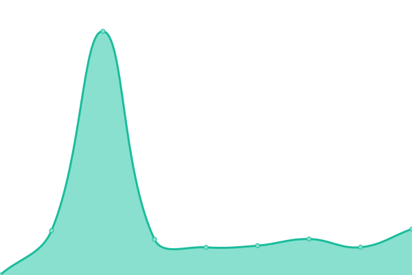
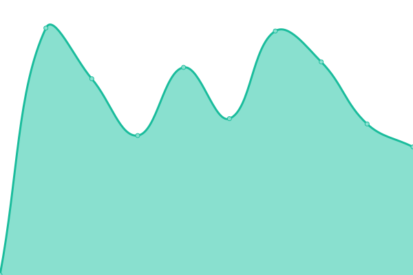
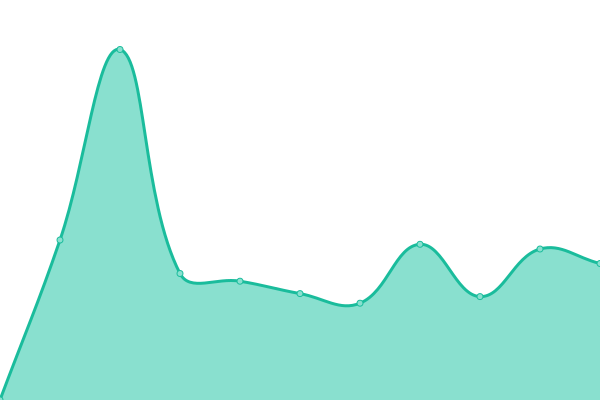
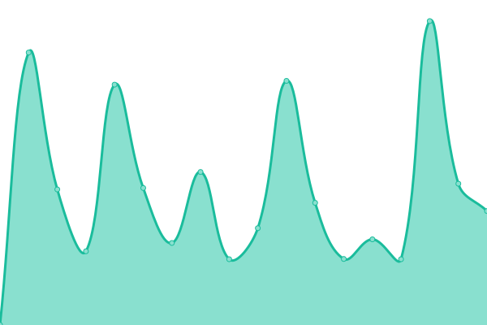

# [📈 Live Status](https://upptime.github.io/upptime): <!--live status--> **🟩 All systems operational**

This repository contains the open-source uptime monitor and status page for [Upptime](https://upptime.js.org), powered by [Upptime](https://github.com/upptime/upptime).

With [Upptime](https://upptime.js.org), you can get your own unlimited and free uptime monitor and status page, powered entirely by a GitHub repository. We use [Issues](https://github.com/upptime/upptime/issues) as incident reports, [Actions](https://github.com/rglauco/upptime/actions) as uptime monitors, and [Pages](https://upptime.github.io/upptime) for the status page.

<!--start: status pages-->
<!-- This summary is generated by Upptime (https://github.com/upptime/upptime) -->
<!-- Do not edit this manually, your changes will be overwritten -->
<!-- prettier-ignore -->
| URL | Status | History | Response Time | Uptime |
| --- | ------ | ------- | ------------- | ------ |
|  [Sito Web](https://www.comune.preganziol.tv.it) | 🟩 Up | [sito-web.yml](https://github.com/rglauco/upptime/commits/HEAD/history/sito-web.yml) | 

 1357ms
     
 | 

<a href="https://rglauco.github.io/upptime/history/sito-web">93.82%</a>
    

|  [Servizi Online](https://servizionline.comune.preganziol.tv.it) | 🟩 Up | [servizi-online.yml](https://github.com/rglauco/upptime/commits/HEAD/history/servizi-online.yml) | 

 3174ms
     
 | 

<a href="https://rglauco.github.io/upptime/history/servizi-online">99.63%</a>
    

|  [Zimbra](https://posta.comune.preganziol.tv.it) | 🟩 Up | [zimbra.yml](https://github.com/rglauco/upptime/commits/HEAD/history/zimbra.yml) | 

 989ms
     
 | 

<a href="https://rglauco.github.io/upptime/history/zimbra">100.00%</a>
    

|  [NextCloud](https://nc.comune.preganziol.tv.it) | 🟩 Up | [next-cloud.yml](https://github.com/rglauco/upptime/commits/HEAD/history/next-cloud.yml) | 

 1314ms
     
 | 

<a href="https://rglauco.github.io/upptime/history/next-cloud">100.00%</a>
    

|  [Cool Jconon](https://concorsi.comune.preganziol.tv.it) | 🟩 Up | [cool-jconon.yml](https://github.com/rglauco/upptime/commits/HEAD/history/cool-jconon.yml) | 

 902ms
     
 | 

<a href="https://rglauco.github.io/upptime/history/cool-jconon">100.00%</a>
    

<!--end: status pages-->

[**Visit our status website →**](https://upptime.github.io/upptime)

## 📄 License

- Powered by: [Upptime](https://github.com/upptime/upptime)
- Code: [MIT](./LICENSE) © [Upptime](https://upptime.js.org)
- Data in the `./history` directory: [Open Database License](https://opendatacommons.org/licenses/odbl/1-0/)
